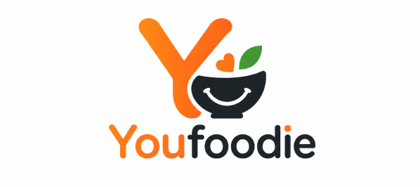

<div align="center">


---

<p align="center">
    <b>YouFoodie</b> é um sistema web de de delivery inspirada em aplicativos como iFood e Uber Eats.
    <br>
    A aplicação permite que usuários realizem cadastro, naveguem por restaurantes, adicionem produtos ao carrinho e façam pedidos de forma simples e intuitiva.
</p>
</div>

---

## 🚀 Tecnologias Utilizadas

### Backend

[](https://skillicons.dev)

### Frontend

[](https://skillicons.dev)

### Infraestrutura

[](https://skillicons.dev)

## ✨ Funcionalidades Principais

### Usuários

- Cadastro de usuários
- Login
- Perfil do usuário

### Restaurantes

- Listagem de restaurantes
- Visualização de cardápios

### Carrinho

- Adicionar itens
- Remover itens
- Alterar quantidade
- Cálculo automático do valor total

### Pedidos

- Finalizar pedido
- Histórico de pedidos

## 📸 Demonstrações

### Página Inicial


---

### Restaurante


---

### Carrinho


---

### Perfil


---

## 📂 Estrutura de Pastas

```text
youfoodie/
├──docker-compose.yml
├──Dockerfile
├──GUIA_USUARIO.md
├──README.md
├──requirements.txt
├───sql/
│   ├──1-schema.sql
│   └──2-seed.sql
└───src/
    ├───app.py
    ├───static/
    │   ├───assets/
    │   ├───css/
    │   │   └──style.css
    │   └───scripts/
    │       ├──addcart.js
    │       ├──clearcart.js
    │       ├──pratos.js
    │       ├──removecart.js
    │       ├──toast.js
    │       └──viacep.js
    ├───templates/
    │   ├──base.html
    │   ├──cadastro.html
    │   ├──carrinho.html
    │   ├──index.html
    │   ├──login.html
    │   ├──perfil.html
    │   ├──pratos.html
    │   ├──restaurante.html
    │   └──restaurantes.html
    └───utils/
        ├──db.py
        └──functions.py
```

## ⚙️ Instalação do Projeto

### Pré-requisitos

- [Git](https://git-scm.com/install/)
  
- [Docker](https://www.docker.com/get-started/)
  
- [Python](https://www.python.org/downloads/)
  
---

### Clonar repositório

```bash
git clone https://github.com/pedroprdgs/YouFoodie.git
```

### Entrar na pasta

```bash
cd YouFoodie
```

## 🔐 Configuração do .env

Crie um arquivo `.env`.

Exemplo:

```env
MYSQL_HOST=mysql
MYSQL_PORT=3306
MYSQL_DATABASE=youfoodie
MYSQL_USER=cliente
MYSQL_PASSWORD=123456
SECRET_KEY=chave
```

## 🐳 Executando com Docker

> **observação:** para computadores windows é necessário configurar WSL

### Construir containers

```bash
docker compose build
```

### Iniciar aplicação

```bash
docker compose up -d
```

### Verificar containers

```bash
docker ps
```

## 🌐 Acessando o Sistema

### Localmente

```text
http://localhost:5000
```

---

>[!NOTE]
>Você pode acessar o [Guia de usuário](GUIA_USUARIO.md) se precisar de ajuda com a instalação ou configuração do projeto
